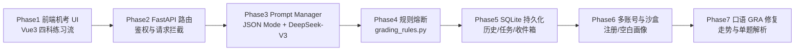
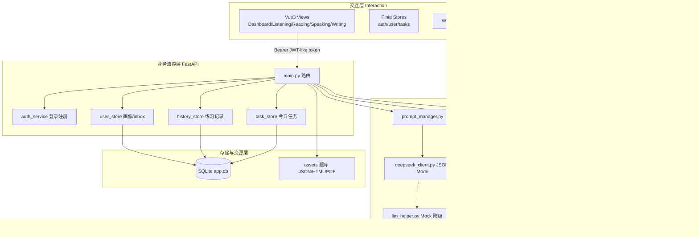
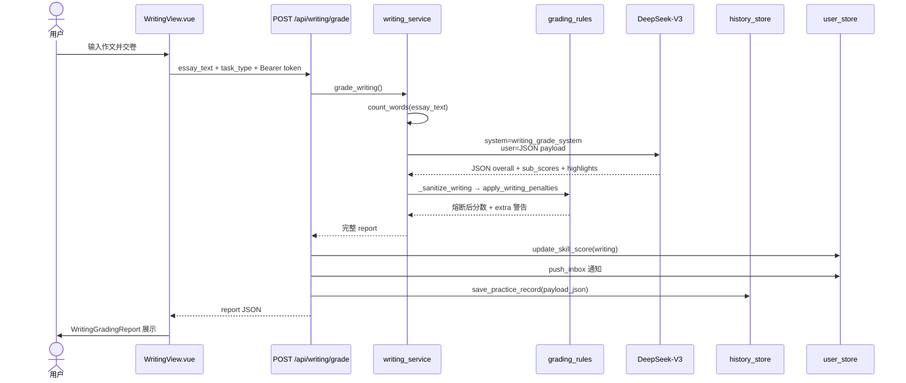
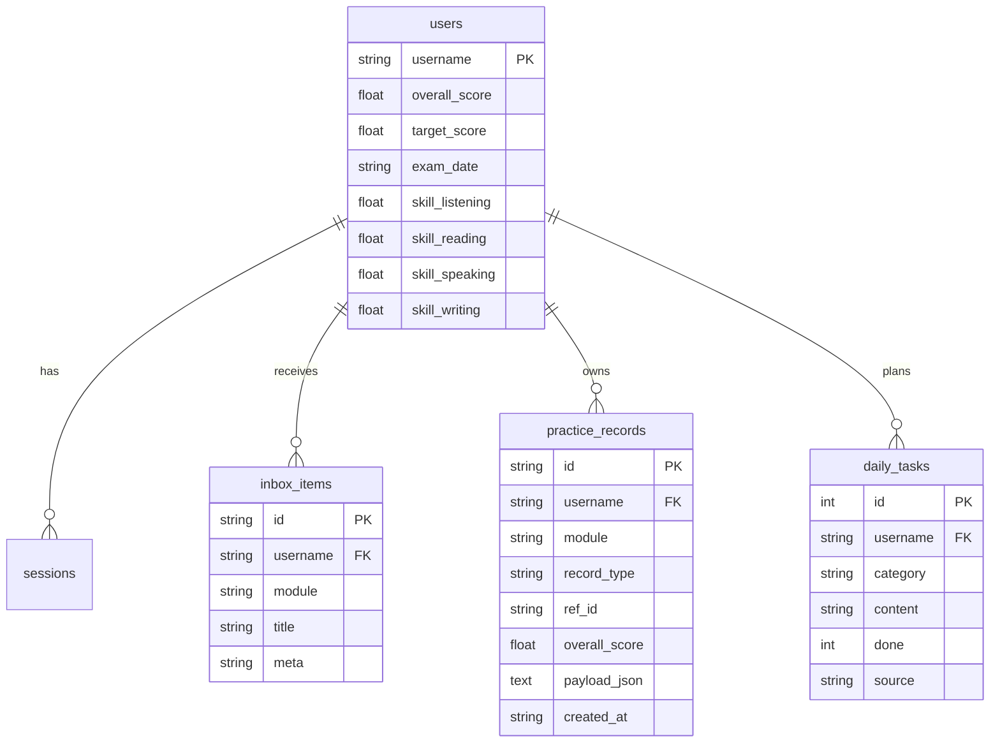
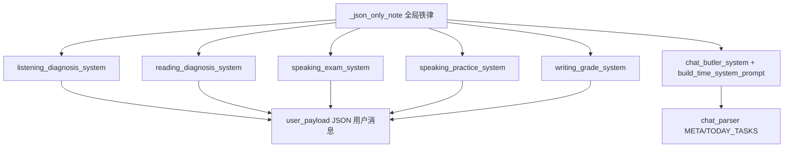
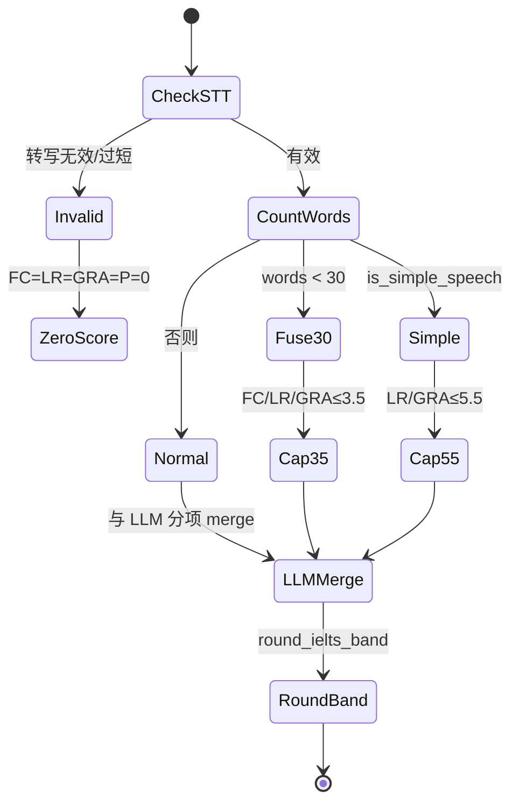
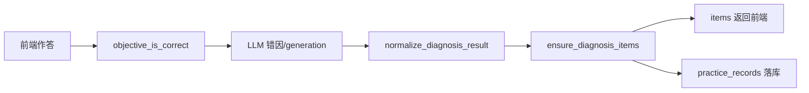

# 自然语言处理课程报告

## 《IELTS AI Prep Companion 雅思智能备考助手》垂直场景对话与批改系统的设计与实现

---

**课程名称：** 自然语言处理  
**专业方向：** 计算机科学与技术 · NLP  
**项目类型：** 全栈 Web 应用（Vue 3 + FastAPI + SQLite + LLM）  
**代码仓库：** https://github.com/loeynah/ielts-ai-assistant  
**报告版本：** v1.0 · 2026-06  

---

## 目 录

1. [引言](#1-引言)  
   1.1 [课题研究背景与雅思备考痛点](#11-课题研究背景与雅思备考痛点)  
   1.2 [系统功能指标化定义与设计目标](#12-系统功能指标化定义与设计目标)  
   1.3 [项目研究与实现路线图](#13-项目研究与实现路线图)  
2. [设计内容与技术选型](#2-设计内容与技术选型)  
   2.1 [核心技术栈总览](#21-核心技术栈总览)  
   2.2 [关键选型原理与工程学思考](#22-关键选型原理与工程学思考)  
3. [系统架构设计](#3-系统架构设计)  
   3.1 [整体架构设计](#31-整体架构设计)  
   3.2 [核心业务流时序图](#32-核心业务流时序图)  
   3.3 [数据存储架构与持久化设计](#33-数据存储架构与持久化设计)  
   3.4 [项目目录结构树](#34-项目目录结构树)  
4. [核心 NLP 技术与业务控制算法](#4-核心-nlp-技术与业务控制算法)  
   4.1 [四维评分 Prompt 工程与结构化 JSON 输出](#41-四维评分-prompt-工程与结构化-json-输出)  
   4.2 [严厉判分熔断机制与后端数据强控算法](#42-严厉判分熔断机制与后端数据强控算法)  
   4.3 [听力/阅读流式诊断与词汇助手逻辑](#43-听力阅读流式诊断与词汇助手逻辑)  
5. [核心模块划分与关键代码落地](#5-核心模块划分与关键代码落地)  
   5.1 [主页 AI 管家与任务同步闭环](#51-主页-ai-管家与任务同步闭环)  
   5.2 [口语多模态交互与得分走势](#52-口语多模态交互与得分走势)  
   5.3 [写作/阅读/听力智能批改服务层](#53-写作阅读听力智能批改服务层)  
6. [系统运行与效果展示](#6-系统运行与效果展示)  
   6.1 [运行环境与启动流水线](#61-运行环境与启动流水线)  
   6.2 [典型备考场景演示](#62-典型备考场景演示)  
7. [总结与展望](#7-总结与展望)  
   7.1 [垂直场景 AI 落地体悟](#71-垂直场景-ai-落地体悟)  
   7.2 [不足与未来演进方向](#72-不足与未来演进方向)  
   7.3 [结语](#73-结语)  

---

## 1 引言

### 1.1 课题研究背景与雅思备考痛点

进入大语言模型（Large Language Model, LLM）时代后，自然语言处理技术正从「实验室指标竞赛」转向「垂直场景生产力工具」。教育评测是典型的 NLP 落地场景：它同时涉及**理解**（读懂题目与作答）、**生成**（给出解释与改进建议）、**结构化推理**（按官方 Rubric 拆维度打分）与**多轮对话**（学习计划协商）。雅思（IELTS）作为国际标准化语言考试，其听、说、读、写四科能力模型与评分标准高度结构化，天然适合与 Prompt Engineering + JSON Mode + 后端规则引擎结合，构建可复现、可审计的智能备考系统。

传统雅思备考存在三类结构性痛点：

**（1）人工批改成本与反馈周期。** 写作 Task2 或口语 Part2/3 的真人模考与精批，单次费用往往在数十至数百元人民币，且需要 24–72 小时才能收到反馈。对于「今天错了 5 道阅读题，想知道为什么错」这类高频、低延迟需求，传统路径几乎无法满足。

**（2）错因诊断停留在「对/错」层面。** 机考软件可以自动核对客观题答案，但很少给出「干扰项为何像对的」「原文哪一句发生同义替换」「转折词后信息如何修正」等**可操作的 NLP 级解释**。学习者知道错了，却不知道认知或策略错在哪一环节。

**（3）口语/写作多维评价难以实时拆解。** 官方口语 Rubric 包含 FC（流利度与连贯性）、LR（词汇）、GRA（语法）、P（发音）四维；写作包含 TR/TA、CC、LR、GRA。没有 STT（Speech-to-Text）与结构化 LLM 输出的配合，很难在练习当场给出「逐句纠错 + 高分示范 + 维度分」的完整报告。

本课题《IELTS AI Prep Companion》即面向上述痛点，构建一套**前端机考模拟 + 后端 NLP 批改 + SQLite 持久化画像**的闭环系统，使学习者在本地即可体验接近「AI 考官 + AI 教研总监」的反馈强度。

> **[图1-1 传统备考 vs AI 闭环备考对比示意图]**  
> （建议插入：左侧人工批改流程时序；右侧本系统 Vue→FastAPI→LLM→SQLite 流程）

### 1.2 系统功能指标化定义与设计目标

系统将「严厉、可审计、可持久化」作为核心非功能需求，关键指标如下表。

**表1-1 系统功能维度与设计指标**

| 维度 | 设计目标 | 具体指标 / 实现锚点 |
|------|----------|---------------------|
| 写作字数熔断 | 对齐官方「字数不足降维打击」 | Task1 \<50 词：TR/TA≤3，Overall≤4；\<100 词：TR/TA≤4；Task2 \<80 词：TR≤3；\<180 词：TR≤4 |
| 口语 STT 有效性与字数熔断 | 拒绝无效录音「刷分」 | 转写 \<8 字符或时长 \<2s 视为无效；有效词数 \<30：FC/LR/GRA≤3.5，Overall≤3.5 |
| 口语简单表达惩罚 | 抑制「I think... good... nice」式幼稚重复 | 启发式检测 unique_ratio、平均词长、口语标记词占比；触发则 LR/GRA≤5.5 |
| 听/读客观题判定 | LLM 不得改判 | `objective_is_correct()` 强制对齐；`normalize_diagnosis_result()` 以客观结果覆盖 status |
| 写作四维批改 | TR/TA、CC、LR、GRA 分项 + 范文 | JSON Schema 固定字段；`_sanitize_writing()` 二次熔断 |
| 口语四维批改 | FC/LR/GRA/P + 逐句纠错 | 模考 `_sanitize_exam_result()`；练习 `_sanitize_practice_result()` 强制 GRA 字段 |
| 主页 AI 管家 | 可执行计划 + 画像更新 | `[META]` / `[TODAY_TASKS]` 结构化块；PATCH `exam_date` / `target_score` |
| 多账号持久化 | 刷新/重登不丢数据 | SQLite：`users`、`practice_records`、`daily_tasks`、`inbox_items` |
| 新用户沙盒 | 零预设，对话驱动画像 | `BLANK_USER_PROFILE`：目标分/考试日/能力分为空；任务列表为空 |
| LLM 可用性 | 无 Key 仍可 Demo | `llm_json_or_mock()` 降级 Mock；`source=backend-mock` 标记 |

### 1.3 项目研究与实现路线图

研发过程遵循「**交互先行 → 后端强控 → Prompt 固化 → 持久化闭环**」四阶段路线，如图1-2所示。

**图1-2 项目研究与实现路线图**



从 NLP 视角看，Phase3–4 构成「**生成式模型 + 符号规则**」混合系统：LLM 负责自然语言解释与开放性评价，Python 规则层负责**硬约束**（字数、客观题、无效 STT），二者缺一不可。

---

## 2 设计内容与技术选型

### 2.1 核心技术栈总览

**表2-1 技术栈与职责划分**

| 层级 | 技术选型 | 在本项目中的职责 |
|------|----------|------------------|
| 交互层 | Vue 3 + Pinia + Vue Router | 五页 SPA、登录注册、练习 UI、ECharts 走势 |
| 样式层 | Tailwind CSS v4 | 统一视觉、响应式卡片与机考布局 |
| 可视化 | ECharts + vue-echarts | 口语 FC/LR/GRA 分项折线 |
| 多模态（前端） | Web Speech API | STT 转写、TTS 题目朗读（浏览器侧） |
| 网关层 | FastAPI + Uvicorn | REST API、CORS、Bearer 鉴权、lifespan 初始化 DB |
| 持久层 | SQLite（Python stdlib） | 用户、会话、练习 JSON、任务、通知 |
| HTTP 客户端 | httpx | 异步调用 SiliconFlow OpenAI 兼容接口 |
| LLM | DeepSeek-V3（`deepseek-ai/DeepSeek-V3`） | 批改、诊断、计划生成 |
| 文档解析 | pypdf | 听力 PDF 文本抽取辅助 Prompt 上下文 |
| 配置 | python-dotenv | `.env` 管理 API Key，禁止入库 |

### 2.2 关键选型原理与工程学思考

#### 2.2.1 为何选用 DeepSeek-V3（经 SiliconFlow 接入）

1. **性价比与上下文长度：** 教育批改场景单次 Prompt 常含千字级作文或听读原文摘录，DeepSeek-V3 在中文解释、英文纠错对照方面表现稳定，API 成本显著低于部分闭源旗舰模型。  
2. **JSON Mode 友好：** 通过 `response_format: {"type":"json_object"}` 约束输出，便于 `llm_json_or_mock()` 统一解析；本项目所有批改链路均要求「仅 JSON、禁止 Markdown」。  
3. **中文教研文案能力：** 错因分析、计划建议、严厉警告需中文输出；DeepSeek 在「英中对照纠错 reason」类任务上可减少后处理成本。

#### 2.2.2 为何采用 FastAPI + SQLite 本地持久化

1. **有状态画像 vs 无状态 HTTP：** LLM 调用本身无状态，但备考是** longitudinal** 过程——考试倒计时、四科预估分、历史批改 JSON 必须跨会话保留。SQLite 单文件 `backend/data/app.db` 满足课程/个人部署零运维需求。  
2. **多账号沙盒：** 所有查询带 `username` 外键，注册用户使用 `BLANK_USER_PROFILE`（`-1` 分表示未设定），与 admin 种子数据隔离。  
3. **练习记录即 JSON 文档：** `practice_records.payload_json` 存完整 LLM 输出，便于日后做 RAG 或错题复盘，无需再拆细表。

#### 2.2.3 为何必须引入后端规则强控（熔断覆盖）

大模型存在两类系统性风险：

- **幻觉（Hallucination）：** 编造未出现的口语内容、错判客观题。  
- **仁慈偏置（Leniency Bias）：** 字数明显不足仍给 6–7 分，违背官方 Rubric。

因此本项目采用 **「LLM 提案 + 规则裁决」** 范式：  
`apply_writing_penalties()` / `apply_speaking_penalties()` 在 `_sanitize_*()` 中**无条件覆盖**模型分项分；听读诊断中 `objective_is_correct()` 为唯一真理来源。这是工业级 NLP 应用区别于「纯 Chatbot Demo」的关键分界线。

> **[图2-1 LLM 提案 + 规则裁决 双通道控制示意图]**  
> （建议插入：LLM 输出箭头进入 Sanitizer，规则引擎箭头覆盖后输出）

---

## 3 系统架构设计

### 3.1 整体架构设计

系统采用四层逻辑架构，如图3-1所示。

**图3-1 系统整体架构图**



### 3.2 核心业务流时序图

以 **Task2 写作提交** 为例，展示从用户输入到持久化通知的完整 NLP 业务流（图3-2）。

**图3-2 写作批改核心业务流时序图**



口语模考流程额外包含：**浏览器 STT → transcript 有效性 `_is_valid_transcript` → 分 Part 合并 → `_sanitize_exam_result`**，其多模态入口在交互层完成，NLP 层仅消费文本。

### 3.3 数据存储架构与持久化设计

**图3-3 核心实体 ER 图**



**沙盒设计要点：**

- **新注册用户：** `register_user()` 写入 `BLANK_USER_PROFILE`（`exam_date=""`，各 skill 为 `-1` 存库，API 层映射为 `null`）；不调用 `seed_admin_tasks()`。  
- **admin 种子：** `seed_admin_user()` 写入考试日 `2026-06-25`、目标 7.0、四科 6.0，并 `seed_admin_tasks()` 注入 4 条默认打卡。  
- **练习历史：** 每次听/读/说/写 AI 调用成功后，`save_practice_record()` 将**完整 LLM+Sanitizer 结果**序列化入 `payload_json`，供前端 ECharts 或未来错题本使用。

### 3.4 项目目录结构树

**图3-4 项目目录结构树（含模块注释）**

```
ielts-ai-dashboard/
├── 📄 README.md                          # 部署与 API 说明
├── 📄 NLP课程报告-IELTS-AI-Prep-Companion.md  # 本报告
├── 📁 assets/                             #  静态题库资源
│   ├── reading-exams/                    #    6 套阅读 JS 题库
│   ├── listening/                        #    4 套听力 HTML/PDF/音频
│   ├── writing/                          #    Task1 图表 PNG
│   └── CONTENT.md                        #    题库清单
├── 📁 backend
│   ├── main.py                           #  FastAPI 路由总入口
│   ├── requirements.txt
│   ├── .env.example                      #    SiliconFlow Key 模板
│   ├── 📁 data/                          #  SQLite（gitignore）
│   │   └── app.db
│   └── 📁 app/
│       ├── db.py                         #    建表 init_db
│       ├── user_store.py                 #  用户/会话/inbox
│       ├── history_store.py              #  练习记录 JSON
│       ├── task_store.py                 #  今日任务 CRUD
│       ├── auth_service.py               #  登录/注册
│       ├── prompt_manager.py             #  全科 System Prompt
│       ├── grading_rules.py              #  字数熔断/客观题
│       ├── diagnosis_normalize.py        #  听读 LLM 输出对齐
│       ├── deepseek_client.py            #  LLM HTTP + JSON Mode
│       ├── llm_helper.py                   #  Mock 降级
│       ├── chat_service.py               # 💬 主页 AI 管家
│       ├── chat_parser.py                #    [META]/[TODAY_TASKS] 解析
│       ├── listening_service.py          #  听力诊断
│       ├── reading_service.py            #  阅读诊断+助手
│       ├── speaking_service.py           #  口语批改+sanitize
│       └── writing_service.py            #  写作批改+sanitize
└── 📁 src/
    ├── views/                            #  五大页面 + Login
    ├── components/                         #    分科 UI / ECharts / 报告卡
    ├── stores/                           #    Pinia auth/user/tasks
    ├── api/                              #    前端 HTTP 封装
    └── config/                           #    题目注册表 speakingExams 等
```

---

## 4 核心 NLP 技术与业务控制算法

### 4.1 四维评分 Prompt 工程与结构化 JSON 输出

本项目将 Prompt 集中管理于 `prompt_manager.py`，所有模板共享 `_json_only_note()`：**仅 JSON、禁止 Markdown、铁面无私**。下面分科说明 Schema 设计逻辑。

#### 4.1.1 写作批改 JSON Schema

写作 Prompt（`writing_grade_system()`）要求对齐 **TR/TA（任务回应/图表描述）、CC（连贯）、LR（词汇）、GRA（语法）** 四维，并强制 `grammar_highlights` 逐句纠错：

```json
{
  "overall_score": 6.5,
  "sub_scores": { "TR_TA": 6.0, "CC": 6.5, "LR": 6.5, "GRA": 6.0 },
  "strengths": ["..."],
  "weaknesses": ["..."],
  "grammar_highlights": [
    { "original": "...", "corrected": "...", "reason": "主谓一致/中式英语..." }
  ],
  "polished_essay": "满分示范段落...",
  "general_advice": "..."
}
```

User 消息通过 `user_payload()` 序列化为 JSON 字符串，包含 `word_count`、`prompt`、`essay_text[:6000]`，使模型在生成前即「看见」字数事实，减少与后端熔断的冲突。

#### 4.1.2 口语模考与练习 JSON Schema

- **模考：** `parts.part1/2/3` 各含 `sub_scores.{FC,LR,GRA,P}`、`examiner_corrections`、`polished_text`。  
- **练习：** 扁平结构 + `examiner_corrections[]` 数组（`original/corrected/reason`），**强制 `gra` 非 null**，解决前端 GRA 走势图恒为 0 的字段丢失问题。

#### 4.1.3 听/读诊断 JSON Schema

要求 LLM 以**真实题号为 Key** 的字典返回，禁止用「题型名」代替题号：

```json
{
  "items": {
    "14": {
      "status": "错误",
      "correct_answer": "B",
      "analysis": "严厉错因：干扰项...",
      "paraphrase": "原文 → 录音替换",
      "suggestion": "精听/定位动作建议"
    }
  }
}
```

前端提交的 `objective_status` 已在 user payload 中预计算，Prompt 仍强调「不得改判」，最终由 `normalize_diagnosis_result()` 再次用 `objective_is_correct()` 锁定。

**图4-1 Prompt 模板分层结构图**



### 4.2 严厉判分熔断机制与后端数据强控算法

#### 4.2.1 雅思 band 离散化

官方分数以 0.5 为步长。系统采用：

$$\text{Band}(s) = \frac{\text{round}(\clamp(s, 0, 9) \times 2)}{2}$$

对应 `score_utils.round_ielts_band()`。听力的客观题预估 band 采用：

$$\text{Raw} = 3 + \frac{\text{correct}}{\text{total}} \times 6$$

再经 `round_ielts_band` 离散化（`estimated_listening_band`）。

#### 4.2.2 写作字数熔断逻辑

`apply_writing_penalties(task_type, essay_text, sub_scores, overall)` 在 LLM 输出之后执行，核心规则包括：

| 条件 | TR/TA 上限 | Overall / 连带 |
|------|------------|----------------|
| Task1 词数 \<50 | ≤3.0 | Overall≤4.0，CC/GRA 跟随 TR |
| Task1 词数 \<100 | ≤4.0 | CC/GRA 下调 |
| Task2 词数 \<80 | ≤3.0 | CC/GRA≤4.0 |
| Task2 词数 \<180 | ≤4.0 | CC/GRA 不得虚高 |

#### 4.2.3 口语 STT 与字数熔断

**有效性判定**（`speaking_service._is_valid_transcript`）：

- 去空后长度 ≥ `MIN_TRANSCRIPT_CHARS=8`  
- 时长 \>0 时须 ≥ `MIN_DURATION_SEC=2.0`  
- 排除占位符「未检测到有效语音」

**字数熔断**（`apply_speaking_penalties`）：词数 \<30 时 FC/LR/GRA ≤3.5，Overall ≤3.5，并追加 `【严厉警告】` 文案。

**简单表达启发式**（`is_simple_speech`）：

- 唯一词比例 \<0.45，或平均词长 \<4.2，或 good/nice/think 等标记词占比 \>22% → LR/GRA ≤5.5

#### 4.2.4 Sanitizer 代码锚点

写作强控入口：

```python
def _sanitize_writing(result: dict, task_type: str, essay_text: str) -> dict:
    sub = result.get("sub_scores") or {}
    overall = float(result.get("overall_score", 6.0))
    sub, overall, extra = apply_writing_penalties(task_type, essay_text, sub, overall)
    # extra 警告合并进 weaknesses / general_advice
    result["sub_scores"] = sub
    result["overall_score"] = overall
    return result
```

口语模考强控在 `_sanitize_exam_result()`：分 Part 合并 STT → `_merge_part_report()` 内再次 `apply_speaking_penalties`；若无任何有效 Part，Overall 强制 0。

**图4-2 判分熔断状态机（口语）**



### 4.3 听力/阅读流式诊断与词汇助手逻辑

#### 4.3.1 听读诊断流水线

1. 前端提交 `all_answers` + `question_meta`（题号映射）。  
2. 后端 `answer_payload` 预填 `objective_status`。  
3. LLM 返回 per-question 分析 JSON。  
4. `normalize_diagnosis_result()` 统一为 `items[]`，**is_correct 仅由客观比对决定**。  
5. `ensure_diagnosis_items()` 补齐缺失题号，Mock 降级时仍保证每题有诊断卡片。  
6. `main.py` 中 `save_practice_record()` 持久化 + `push_inbox()`。

#### 4.3.2 阅读词汇/长难句助手

`reading_service.assistant_reply()` 接收用户选中的句子或单词，独立调用 LLM 做成分分析与同义替换建议（与诊断 Prompt 分离），满足「精读场景下即时 NLP 辅导」需求。

**图4-3 听读诊断数据流**



---

## 5 核心模块划分与关键代码落地

本章从可运行系统视角，将第 4 章的 NLP 算法与前端 UI 逐一对应，并给出演示操作步骤与运行截图说明。除特别注明外，下列截图均为：启动后端（uvicorn main:app --reload --port 8000）与前端（npm run dev）后，在浏览器 http://localhost:5173 中实际操作所得。

---

### 5.1 主页 AI 管家与任务同步闭环

#### 5.1.1 模块职责与业务闭环

主页 AI 管家是本系统唯一的多轮对话入口，承担「备考咨询 + 可执行计划生成 + 用户画像写入」三类 NLP 任务。其业务闭环可形式化为：

$$\text{用户自然语言输入} \rightarrow \text{LLM 计划生成} \rightarrow \text{结构化块解析} \rightarrow \text{画像 PATCH + 任务 PUT} \rightarrow \text{SQLite 持久化}$$

具体阶段如下：

| 阶段 | 用户可见行为 | 后端 / 前端关键组件 |
|------|--------------|---------------------|
| ① 诊断盲区 | 用户描述目标分、倒计时、薄弱项 | POST /api/chat → build_plan_reply() |
| ② 针对练 | AI 返回分科训练建议 + [TODAY_TASKS] | chat_butler_system() + parse_chat_response() |
| ③ 一键同步 | 点击「将此计划一键同步至今日打卡清单」 | AiChatPanel.handleAction('sync-plan') |
| ④ 勾选打卡 | 用户勾选 checkbox 标记完成 | tasksStore.save() → PUT /api/tasks |
| ⑤ 持久化 | 刷新/重登后任务仍在 | SQLite 表 daily_tasks |

新注册用户初始 exam_date、target_score、四科能力分、今日任务均为空；本模块的设计目标即是：通过一轮对话，将「自然语言意图」转化为可存储、可执行的结构化备考状态。

#### 5.1.2 后端核心逻辑：chat_service.build_plan_reply()

build_plan_reply() 是 AI 管家的编排中枢，其处理流水线如下：

- 画像注入：从 SQLite 经 require_user 注入的 user_profile 读取 exam_date、target_score。新用户字段为 null，不会触发 days_until() 异常（已在 time_context.py 做空值保护）。
- 倒计时计算：若已有考试日，则 days_until(exam_date) 得到剩余天数并写入 System Prompt；若为空，Prompt 指示模型从用户「还有 N 天考试」表述中反推 exam_date，并在 [META] 块输出。
- LLM 调用：chat_completion(messages, temperature=0.5)。计划类生成略提高温度（0.5），在保持 JSON 结构约束的前提下增加任务多样性；批改类接口则使用 0.2 以保证稳定性。
- 结构化剥离：parse_chat_response() 用正则提取 [META]（考试日、目标分）与 [TODAY_TASKS]（listening|任务 格式），正文部分作为用户可见回复。
- 前端联动：AiChatPanel 在收到响应后，先 applyChatMeta() 调用 PATCH /api/user/profile；用户点击同步按钮后，再 addTasksFromAi() 并 PUT /api/tasks 写入数据库。

chat_parser.py 中结构化块的解析锚点为：

```python
BLOCK_RE = re.compile(r"\[(META|TODAY_TASKS)\](.*?)\[/\1\]", re.DOTALL)
```

_parse_meta() 逐行解析 exam_date:、target_score:；_parse_tasks() 按 category|content 切分任务行，category 限定为 listening/reading/speaking/writing/other，保证与前端 TaskChecklist 分类图标一致。

#### 5.1.3 前端交互：AiChatPanel.vue

前端在 sendUserText() 中调用 requestChat()，流式打字机效果展示 AI 回复。当后端检测到用户消息含「计划」「备考」等关键词，或 LLM 返回了 today_tasks 时，会在消息气泡下方挂载两个 Action 按钮：

- sync-plan：调用 tasksStore.addTasksFromAi(meta.today_tasks)，并可选更新 exam_date / target_score；
- keep-plan：仅确认，不写入任务表。

该设计将「LLM 提案」与「用户确认写入」分离，避免模型每次回复都污染用户任务清单，符合工业级对话系统的 Human-in-the-loop 原则。

#### 5.1.4 运行演示与截图说明

【演示环境准备】

1. 终端 1：cd backend，确认 .env 已配置 SiliconFlow DEEPSEEK_API_KEY，执行 uvicorn main:app --reload --port 8000。
2. 终端 2：cd 项目根目录，执行 npm run dev，浏览器访问 http://localhost:5173。
3. 登录页点击「没有账号？立即注册」，注册测试账号（如 student_demo），登录进入主页。务必使用新账号，以体现「空白画像 → 对话驱动更新」的完整链路。

【图5-1 操作步骤】

1. 进入 /dashboard，确认右侧日历显示「尚未设置考试日期」，能力诊断为「—」。
2. 在中间「AI 智能管家」卡片输入框发送：

   > 我目标 7.5 分，还有 25 天考试，口语比较弱，帮我定今日计划

3. 等待 AI 回复完毕（打字机动画结束），界面应出现：
   - 右侧：你的用户消息气泡；
   - 左侧：AI 分阶段备考建议（诊盲区 → 针对练）；
   - AI 消息下方：「将此计划一键同步至今日打卡清单」与「保持原计划不变」两个按钮。
4. 若右侧日历同步刷新出考试日星标、倒计时变化，可一并纳入截图，证明 [META] 已触发 PATCH /api/user/profile。

【图5-1 截图内容说明】

图5-1 应清晰展示 NLP 多轮对话与可执行 Action 的完整交互态：包含「AI 智能管家」标题、用户输入的 7.5 分/25 天/口语薄弱等关键信息、AI 结构化计划回复、以及两个同步按钮。该图对应后端 chat_service → chat_parser → DeepSeek-V3 链路的成功运行，是 5.1 模块的核心证据图。

> [图5-1 主页 AI 管家对话与计划生成（运行截图）]

【图5-2 操作步骤】

1. 空态（可选，单独一图）：新账号刚登录、尚未与 AI 对话时，向下滚动至「今日任务打卡」卡片，应见提示：「暂无任务，点击『添加打卡』或让 AI 小助手生成计划后一键同步」，进度为 0 / 0。
2. 同步后：回到图5-1 界面，点击「将此计划一键同步至今日打卡清单」；AI 会追加一条确认消息（如「已将 N 条今日任务同步…」）。
3. 再次滚动至「今日任务打卡」，应出现多条带听力/阅读/口语/写作分类标签的任务，角标「AI 生成」，进度变为 0 / N。
4. 可选：勾选一条任务前的 checkbox，证明 PUT /api/tasks 可更新 done 状态。

【图5-2 截图内容说明】

图5-2 重点展示结构化任务从 LLM 落地到 SQLite 的结果：任务卡片含分类图标、具体训练内容（如 Part 2 专项、精听 Section 等）、以及「AI 生成」来源标记。若采用对比排版，左半为同步前空态、右半为同步后列表，更能体现闭环完整性。

> [图5-2 今日任务打卡清单——同步前空态与同步后列表（运行截图）]

---

### 5.2 口语多模态交互与得分走势

#### 5.2.1 模块职责：浏览器多模态 + 后端文本判分

口语模块是本项目唯一涉及多模态输入的分科：交互层使用浏览器 Web Speech API 完成 STT（Speech-to-Text），可选 TTS 朗读考官题目；NLP 判分层仅消费文本转写，不直接处理音频波形。这样设计的原因在于：课程项目周期内优先保证「转写 → 四维 Rubric 批改 → 结构化 JSON」链路稳定，发音维度 P 由 LLM 基于转写间接推断，未来可扩展声学模型。

前端数据流：

$$\text{麦克风} \xrightarrow{\text{STT}} \text{transcript（可编辑）} \xrightarrow{\text{POST}} \text{grade-practice / grade-exam} \xrightarrow{\text{sanitize}} \text{报告 UI + history API}$$

#### 5.2.2 后端强控：_sanitize_exam_result 与 _sanitize_practice_result

- 模考：合并 Part1/2/3 转写后，分 Part 调用 _merge_part_report()，再经 apply_speaking_penalties() 熔断；无效 STT 的 Part 分数强制为 0。
- 自定义训练：_sanitize_practice_result() 通过 _normalize_sub_scores() 统一 fc/gra 大小写，保证 GRA 字段必写入 practice_records，供走势图读取。

历史数据不再使用 localStorage，而由 GET /api/history/speaking 从 practice_records.payload_json 还原，SpeakingScoreChart 绘制总分 + FC + LR + GRA 四条曲线。

表5-1 口语走势图字段绑定

| 字段 | 来源 | UI 用途 |
|------|------|---------|
| overall_score | Sanitizer 后 Overall | 蓝色总分折线 |
| sub_scores.FC | 流利度 | 浅蓝分项线 |
| sub_scores.LR | 词汇 | 绿色分项线 |
| sub_scores.GRA | 语法 | 黄色分项线（修复前恒为 0） |
| timestamp | practice_records.created_at | X 轴日期 |

#### 5.2.3 运行演示与截图说明

【演示环境准备】同 5.1.1；使用已注册账号登录即可。

【图5-3 操作步骤——口语得分走势】

1. 左侧导航进入 Speaking（口语）。
2. 切换至「自定义训练」标签。
3. 连续完成至少 2 次有效交卷（每次录音或手动输入 30 词以上英文，点击「确认提交批改」，等待报告出现）。
4. 页面上方「口语得分走势」卡片应出现折线；鼠标悬停某一数据点，Tooltip 显示总分、FC、LR、GRA 数值。
5. 确认黄色 GRA 线随作答质量变化（非全程贴 0）。

【图5-3 截图内容说明】

图5-3 展示 ECharts 多系列折线图：图例含「总分」「流利度 FC」「词汇 LR」「语法 GRA」，X 轴为交卷日期，Y 轴为 4–9 分 band。该图证明 history_store 持久化 + 前端 subScoreFromHistory() 绑定正确，是口语 GRA Bug 修复的回归验证截图。

> [图5-3 口语得分走势图（含 GRA 黄线及 Tooltip）（运行截图）]

【图5-4 操作步骤——自定义训练四维报告】

1. 仍在口语 → 自定义训练。
2. 点击「开始录音回答」，录制 30 秒以上英文；或在 STT 文本框手动粘贴一段 60 词左右的 Part 3 风格回答（便于复现稳定批改结果）。
3. 点击「确认提交批改」，等待 SpeakingPracticeReport 卡片展开。
4. 报告应包含：Overall 分数、FC/LR/GRA/P 四维进度条、考官逐句纠错（原句删除线 + 修改句 + reason）、AI 高分示范、底部 advice。

【图5-4 截图内容说明】

图5-4 是 _sanitize_practice_result() 返回 JSON 的前端完整渲染：须同时出现四维分项与至少一条 examiner_corrections 条目，体现「单题交卷 ≠ 仅一个总分」，而是全套 NLP 解析报告。建议截图包含上方用户英文气泡 + 下方白色报告卡，上下文更完整。

> [图5-4 口语自定义训练四维报告与逐句纠错（运行截图）]

---

### 5.3 写作 / 阅读 / 听力智能批改服务层

#### 5.3.1 服务层统一架构

听、读、说、写四科在 NLP 层遵循同一范式：

$$\text{Prompt 模板} + \text{user\_payload(JSON)} \xrightarrow{\text{JSON Mode}} \text{LLM 输出} \xrightarrow{\text{Sanitize/Normalize}} \text{持久化 + 通知}$$

表5-2 服务层模块对照

| 模块 | 入口函数 | 强控 / 归一化 | API 路径 | 持久化 module |
|------|----------|---------------|----------|---------------|
| writing_service | grade_writing() | _sanitize_writing → apply_writing_penalties | POST /api/writing/grade | writing |
| speaking_service | grade_speaking_exam() | _sanitize_exam_result | POST /api/speaking/grade-exam | speaking |
| speaking_service | grade_speaking_practice() | _sanitize_practice_result | POST /api/speaking/grade-practice | speaking |
| listening_service | diagnose_listening() | normalize_diagnosis_result + objective_is_correct | POST /api/listening/diagnose | listening |
| reading_service | diagnose_reading() | 同上 | POST /api/reading/diagnose | reading |

#### 5.3.2 LLM 统一调用与降级

所有批改/诊断接口均通过 llm_json_or_mock() 封装，在 API Key 缺失或 SiliconFlow 不可达时自动降级 Mock，保证答辩 Demo 不中断：

```python
async def llm_json_or_mock(messages, mock_fn, temperature=0.2):
    try:
        raw = await chat_completion(messages, temperature=temperature, json_mode=True)
        return json.loads(raw)
    except Exception:
        return mock_fn()  # source=backend-mock
```

Mock 路径仍经过 _sanitize_* 与 normalize_diagnosis_result，因此熔断规则在演示模式下同样生效。

#### 5.3.3 写作模块运行演示（图5-5）

【操作步骤】

1. 导航进入 Writing（写作）。
2. 在左侧矩阵选择一套真题（如 Cambridge 18），点击 Task 2（大作文）。
3. 确认开始考试，在编辑器输入不少于 180 词的英文议论文（主题可与题目相关，如科技与教育）。
4. 点击交卷/提交批改，等待 WritingGradingReport 渲染。
5. 报告应展示：Overall、TR/TA·CC·LR·GRA 四维分、grammar_highlights 逐句纠错、优缺点列表、polished_essay 范文片段。

【图5-5 截图内容说明】

图5-5 验证写作 Prompt JSON Schema 与 _sanitize_writing() 的联合效果：须可见四维分数条/数字、至少一条语法纠错对照（original → corrected + reason）、以及 AI 改写范文。该图对应 writing_grade_system() 中「铁面无私、grammar_highlights 必填」的 Prompt 约束。

> [图5-5 写作 Task2 四维深度批改报告（运行截图）]

#### 5.3.4 阅读模块运行演示（图5-6）

【操作步骤】

1. 导航进入 Reading（阅读）。
2. 选择一套阅读真题（如 C18 Test 1），在双栏界面完成若干客观题（故意错 2–3 题以生成丰富诊断文案）。
3. 提交答案后，在 AI 面板触发「AI 深度诊断」（或提交后自动出现的诊断区域）。
4. 等待 ItemDiagnosisBoard（mode=reading）渲染逐题卡片。

【图5-6 截图内容说明】

图5-6 应包含至少一道错题卡片：题号、错误/正确状态、error_analysis（严厉错因：定位/偷换概念/转折词陷阱）、paraphrase_pairs（原文 → 替换对照表）、reading_tip（精读动作建议）。该图证明阅读诊断的「逐题切片 NLP 解析」而非仅显示对错，且 objective_is_correct() 为最终裁决，LLM 只负责解释。

> [图5-6 阅读错题 AI 深度诊断卡片（运行截图）]

#### 5.3.5 听力模块运行演示（图5-7）

【操作步骤】

1. 导航进入 Listening（听力）。
2. 选择一课（如 Lesson 103 · P1 International Club），在 iframe 练习区完成听题作答（同样建议错几题）。
3. 提交后触发 AI 深度诊断。
4. 查看 ItemDiagnosisBoard（mode=listening）逐题反馈。

【图5-7 截图内容说明】

图5-7 与图5-6 共用同一 UI 组件，但 NLP 输出侧重不同：听力卡片应突出 listening_tip（如 1.0x 精听、跟读答案句、标注转折词）、paraphrase（录音 ↔ 题干同义替换）、error_analysis（干扰项「先诱后改」类陷阱）。该图对应 listening_diagnosis_system() 中「以真实题号为 Key、逐题精听建议」的 Prompt 设计。

> [图5-7 听力逐题精听建议与错因诊断（运行截图）]

#### 5.3.6 本章截图一览

| 图号 | 模块 | 页面路径 | 证明的技术点 |
|------|------|----------|--------------|
| 图5-1 | AI 管家 | /dashboard | 多轮对话 + [META]/[TODAY_TASKS] + Action 按钮 |
| 图5-2 | 任务同步 | /dashboard | daily_tasks 持久化 + AI 生成任务 |
| 图5-3 | 口语走势 | /speaking | practice_records + GRA 分项图 |
| 图5-4 | 口语练习 | /speaking 自定义训练 | _sanitize_practice_result 四维报告 |
| 图5-5 | 写作批改 | /writing | _sanitize_writing 四维 + 语法纠错 |
| 图5-6 | 阅读诊断 | /reading | normalize_diagnosis_result 阅读切片 |
| 图5-7 | 听力诊断 | /listening | 听力精听建议 + 客观题对齐 |

---

## 6 系统运行与效果展示

本章从系统整体验收角度，补充第 5 章未单独成图的能力与场景。第 5 章已按模块给出听、说、读、写及主页 AI 管家的核心界面与批改结果，下列截图不再重复展示：

- 图5-1 主页 AI 管家对话
- 图5-2 今日任务打卡清单展示
- 图5-3 口语测评界面
- 图5-4 AI 训练报告（自定义训练）
- 图5-5 口语得分走势图
- 图5-6 进行大作文写作
- 图5-7 写作 Task2 四维深度批改报告
- 图5-8 阅读详情界面
- 图5-9 阅读错题 AI 深度诊断卡片
- 图5-10 听力做题界面
- 图5-11 听力逐题精听建议与错因诊断

第 6 章侧重：空白画像起步、口语模考全流程、规则熔断、批改通知闭环，以及阅读随身助理等横切能力。

---

### 6.1 运行环境与启动流水线

表6-1 标准启动流程

| 步骤 | 命令 / 操作 | 说明 |
|------|-------------|------|
| 1 | cd backend && copy .env.example .env | 填入 SiliconFlow DEEPSEEK_API_KEY |
| 2 | pip install -r requirements.txt | 安装 FastAPI/httpx 等 |
| 3 | uvicorn main:app --reload --port 8000 | 自动 bootstrap_storage() 建库 |
| 4 | npm install && npm run dev | 前端默认 :5173 |
| 5 | 访问 /api/health/llm | 确认 configured: true |
| 6 | 登录 admin/123456 或注册新号 | 验证沙盒差异 |

启动成功后，应用 lifespan 会调用 seed_admin_user() 与 seed_admin_tasks()，为 admin 写入演示用考试倒计时（2026-06-25）、四科 6.0 与默认任务；新注册用户则使用 BLANK_USER_PROFILE，四科能力与今日任务均为空，便于与 admin 对照验收多账号隔离。

验收建议：先用新账号走一遍第 5 章各模块截图流程，再切换 admin 观察种子数据差异；若 DEEPSEEK_API_KEY 未配置，各批改接口会经 llm_json_or_mock() 降级 Mock，客观题练习与页面跳转仍可用，但 AI 文案带来源标记 backend-mock。

---

### 6.2 典型备考场景演示

本节以连贯叙述方式说明第 5 章未覆盖、但在答辩中需强调的端到端场景。每个场景均给出操作步骤、预期界面与截图说明；图号从 6-1 起编，与第 5 章图号独立。

#### 6.2.1 新用户空白画像主页

新注册用户首次进入 /dashboard 时，系统尚未写入考试日期、目标分与四科预估分。此时右侧日历无考试日星标，AI 实时能力诊断四格均为「—」，副标题提示「综合与目标尚未设定 · 与 AI 助手对话开始」；向下滚动可见「今日任务打卡」为空（见第 5 章图5-2），「AI 批改通知」卡片显示「完成练习后，批改通知将在此显示」。该状态对应 SQLite 中 BLANK_USER_PROFILE 的 API 映射，是「对话驱动画像」与「练习驱动收件箱」两条链路的共同起点。

操作步骤：登录页注册新账号（勿使用 admin）→ 登录后停留在主页，勿先与 AI 对话 → 截取整页或右侧栏，确保日历、能力诊断、空收件箱同时入镜。

图6-1 应体现「零预设沙盒」：无倒计时、无四科分数、无批改通知，与图5-1 对话后日历刷新、图5-2 任务同步形成前后对照。

> [图6-1 新用户主页空白画像（日历、能力诊断与空收件箱）]

#### 6.2.2 口语标准模考全流程报告

第 5 章图5-3～图5-5 侧重「自定义训练」单题练习与得分走势。口语模块另有一套「标准模拟考试」：Part 1 → Part 2 准备/录音 → Part 3 盲盒录音，交卷后才揭晓 STT 转写，后端按 Part 分别调用 _sanitize_exam_result() 合并报告，并写入 practice_records（record_type 为 exam）。

操作步骤：进入 Speaking → 选择「标准模拟考试」→ 任选一套模考（如 Set 1）→ 按流程完成 Part1/2/3 录音（每段需有效英文转写，过短会提示重录）→ 提交后进入 report 阶段，查看分 Part 分项与 Overall 总分。

图6-2 与图5-4 的区别在于：图5-4 为单题自定义训练的四维报告卡；图6-2 应展示模考结束后的完整 Part 报告结构（Part1/2/3 区块、各 Part 的 FC/LR/GRA/P 或合并 Overall），证明 grade_speaking_exam 与 _merge_part_report 链路可用。

> [图6-2 口语标准模考 Part 分项与 Overall 报告（运行截图）]

#### 6.2.3 字数熔断与严厉低分警告

第 4 章所述 apply_writing_penalties 与 apply_speaking_penalties 需在界面上可感知：当 Task2 作文字数明显不足（如不足 180 词），或口语转写低于 30 词时，后端强制压低 TR/TA、FC、LR、GRA 等分项，并在报告 advice 或 warnings 中追加「【严厉警告】字数严重不足…」类文案，避免模型「安慰性高分」。

操作步骤（写作）：Writing → 任选 Task2 → 故意输入不足 80 词的短作文 → 提交批改 → 在 WritingGradingReport 中查看低 Overall 与警告文案。

操作步骤（口语，可选第二张）：Speaking → 自定义训练 → 输入极短英文（如 Ten words only here.）→ 提交批改 → 报告应出现熔断低分与严厉警告。

图6-3 须同时可见：低 band 分数（通常 ≤3.5）、四维分项被压制的表现，以及含「严厉警告」字样的中文提示，对应第 4 章「LLM 提案 + 规则裁决」的工程化落地。

> [图6-3 写作或口语字数熔断低分与严厉警告（运行截图）]

#### 6.2.4 AI 批改通知收件箱

听、读、说、写任一模块完成 AI 批改或诊断后，main.py 在 save_practice_record() 之后调用 push_inbox()，向 inbox_items 表写入一条通知；用户返回主页时，右侧「AI 批改通知」卡片以时间倒序展示模块图标、标题与 meta（如分数、题号摘要）。

操作步骤：在已完成图5-7（写作）、图5-9（阅读）或图5-11（听力）等任一次批改后 → 点击导航回到 Dashboard → 查看右侧 AI 批改通知列表是否新增条目 → 刷新页面或重新登录，确认通知仍在。

图6-4 展示异步报告回流主页的闭环：至少 2 条来自不同 module（如 writing + reading）的通知，含 icon、title、meta 与 time，证明 SQLite 持久化与 userStore.refresh() 联动正常。

> [图6-4 主页 AI 批改通知收件箱（运行截图）]

#### 6.2.5 阅读随身 AI 助理

阅读模块除图5-8 做题界面与图5-9 错题诊断外，还提供与诊断 Prompt 分离的 assistant_reply()：用户可在「阅读随身 AI 助理」中切换「长难句分析」或「查词模式」，粘贴句子或单词后获得成分拆解、释义与同义替换建议，属于轻量多轮 NLP 辅导，不依赖当次客观题对错。

操作步骤：Reading → 打开任一套真题 → 在右侧或下方 AI 助理区选择「长难句分析」→ 粘贴 1～2 句真题长句 → 发送 → 等待 AI 返回结构化解说；可再切换「查词模式」输入 ubiquitous 等词验证。

图6-5 应包含：模式切换 Tab、用户输入气泡、AI 中文/中英对照回复，与图5-9 的逐题 ItemDiagnosisBoard 形成「精读辅导 vs 错题诊断」双能力对照。

> [图6-5 阅读随身 AI 助理（长难句 / 查词）（运行截图）]

#### 6.2.6 本章与第 5 章截图分工小结

第 5 章按功能模块展示核心交互与批改/诊断结果；第 6 章补全系统级验收场景。图6-1～图6-5 分别对应：空白画像起点、口语模考（区别于自定义训练）、规则熔断可观测性、批改通知持久化、阅读助理辅学。答辩时可先概览图6-1 说明多账号沙盒，再按第 5 章图5-1～5-11 走主功能，最后用图6-3 强调 NLP 工程化熔断，以图6-4 收束「练习 → 持久化 → 主页通知」全链路。

---

## 7 总结与展望

### 7.1 垂直场景 AI 落地体悟

本项目以雅思听、说、读、写四科为垂直切口，将大语言模型嵌入可运行的 Web 备考系统。与通用对话机器人不同，教育评测场景对输出有明确的 Rubric 约束、可审计性与跨会话一致性要求。经过从 Prompt 设计、JSON 结构化、后端 Sanitizer 到 SQLite 持久化的完整实现，可将经验归纳为以下五个方面。

（1）无状态 LLM 与有状态画像的解耦

HTTP 请求本身不记忆用户，但备考是 longitudinal 过程：考试倒计时、目标分、四科预估分、历史批改 JSON、今日任务与收件箱通知，均需在刷新或重新登录后保持。若将这些信息全部堆入 System Prompt，既浪费上下文窗口，又难以保证字段格式稳定。

本项目采用「模型只负责单次 inference，状态由存储层负责」的分工：DeepSeek-V3 每次调用仅处理当次作文、转写或错题集合；user_store 维护画像与 inbox，history_store 以 payload_json 保存完整批改结果，task_store 管理 daily_tasks。主页 AI 管家通过 [META] 块触发 PATCH /api/user/profile，将对话中推断出的 exam_date、target_score 写回数据库，而非仅停留在聊天窗口。该模式使系统可在不改造模型的情况下支持多账号沙盒（BLANK_USER_PROFILE 与 admin 种子数据隔离），也为后续 RAG 错题复盘预留了结构化文档基础。

（2）Prompt 的脆弱性与规则安全垫

即使 System Prompt 多次强调「字数不足不得高分」「不得改判客观题」，实测中仍可能出现仁慈偏置（Leniency Bias）与幻觉（Hallucination）：短作文被给到 6～7 分、听读错题被模型「解释成做对」。纯 Prompt 调参无法从工程上消除这类风险。

因此本项目坚持「LLM 提案 + 规则裁决」：apply_writing_penalties 与 apply_speaking_penalties 在 _sanitize_* 之后无条件覆盖分项分与 Overall；听读链路中 objective_is_correct() 为唯一真理来源，normalize_diagnosis_result() 用客观结果锁定 is_correct，LLM 只负责 error_analysis、paraphrase 与精听/精读建议。第 6 章图6-3 所展示的「严厉警告」文案，正是规则层对用户可见的反馈。这一设计使系统行为可预测、可答辩、可写入课程报告，是 NLP 工程化与「调 Prompt 玄学」的本质区别。

（3）结构化输出是垂直 NLP 的通用接口

JSON Mode 将非结构化语言压缩为 UI 可绑定的字段：写作四维分与 grammar_highlights、口语 sub_scores 与 examiner_corrections、听读 items[] 逐题切片，均可直接驱动 Vue 组件与 ECharts。chat_parser 则用 [META]、[TODAY_TASKS] 块将计划类对话与正文分离，前端 AiChatPanel 再经 Human-in-the-loop 按钮决定是否写入任务表。

归一化层（_normalize_sub_scores、normalize_diagnosis_result、ensure_diagnosis_items）进一步抹平模型大小写不一致、缺字段等问题，保证 Mock 降级路径与真实 LLM 路径输出形状一致。结构化输出因而成为前后端、模型与规则引擎之间的通用接口，使报告卡、走势图、收件箱通知均可自动化生成。

（4）多模态交互与 NLP 判分的边界

口语模块在浏览器侧完成 Web Speech API 的 STT（及可选 TTS），用户可编辑转写后再提交；NLP 判分层仅消费文本，发音维度 P 由模型基于转写间接推断。该取舍在课程项目周期内优先保证「转写 → 四维 Rubric → 持久化历史」链路稳定，避免过早引入声学模型带来的标注与部署成本。未来可在不改变前端交互的前提下，将 acoustic features 作为额外特征注入 Prompt 或独立评分头。

（5）可降级、可演示、可验收的工程闭环

llm_json_or_mock() 在 API Key 缺失或 SiliconFlow 不可达时回退 Mock，且 Mock 仍经过 Sanitizer 与 normalize，保证答辩 Demo 不中断；GET /api/health/llm 提供配置自检。第 5、6 章按模块与系统场景分别配图，形成「代码逻辑 → 运行截图 → 答辩叙述」的完整证据链。对课程项目而言，能本地一键启动、多账号验收、规则熔断可复现，与单纯调用 API 的脚本 Demo 相比，更贴近垂直 NLP 产品的交付形态。

### 7.2 不足与未来演进方向

尽管系统已覆盖四科 AI 批改、计划生成与持久化闭环，仍存在明显局限。以下按技术方向分述现状不足与演进设想，供后续迭代参考。

RAG 与真题知识库

当前听读错因分析、paraphrase 对照与口语/写作示范，主要依赖当次题目上下文与模型参数化知识，无法引用本项目 assets 目录下多套真题的权威解析或同义替换库。错因文案在题目偏冷或表述较偏时，可能出现泛化建议重复、替换对不够精准等问题。

演进方向：对阅读/听力原文、官方解析与高频同义替换对建立向量索引（如 Chroma / FAISS），在 diagnose_listening、diagnose_reading 的 User Payload 中检索 Top-K 片段注入 Prompt；写作/Task2 可检索相似题型范文结构。RAG 不改变 objective_is_correct 与 Sanitizer 裁决权，仅增强解释层的信息密度与可追溯性。

判分校准与专用模型

写作与口语四维分目前完全依赖 LLM 主观推断，虽经熔断规则约束极端情况，但对「6.0 与 6.5 边界」的稳定性仍弱于人工考官。缺乏与 IELTS 官方 Band Descriptor 对齐的标注数据，也难以做定量误差分析。

演进方向：在积累 practice_records 脱敏样本后，可引入 Cross-Encoder 或轻量回归头，对 LLM 给出的 sub_scores 做二次校准；或针对作文/转写微调小模型专门预测 TR/TA、FC 等维度，LLM 负责生成 grammar_highlights 与中文 advice，形成「专用打分 + 通用生成」双模型架构。

发音与声学维度

发音维度 P 无 acoustic model 支撑，STT 错误会传导至 FC/LR/GRA 判断；Web Speech API 在不同浏览器与口音下质量参差，模考「盲盒录音」虽还原考试节奏，但无法检测音素级错误。

演进方向：集成 Whisper 或 Wav2Vec2 提取韵律与发音特征，增加 mispronunciation 检测模块，将声学摘要作为 Prompt 附加字段或独立 P 分预测；前端可保留可编辑转写，但增加「发音热力」可视化，与现有文本批改报告并列展示。

流式体验与延迟优化

批改与诊断接口等待整包 JSON 返回后一次性渲染，Task2 长作文或口语模考多 Part 合并时，用户需数秒至数十秒面对 loading 态，首字延迟影响沉浸感。

演进方向：对 grammar_highlights、examiner_corrections、逐题 items 采用 SSE 或 WebSocket 流式推送，前端按字段增量挂载；计划类对话 chat_completion 可部分流式展示（当前前端已有打字机效果，后端可统一 streaming API）。需在流式场景下仍保证 JSON 完整性或分段 Schema 校验，避免半包解析失败。

多语言、无障碍与合规

界面与 Prompt 以中文解释、英文题目/作答为主，尚未做 i18n；收件箱、警告文案、AI 管家回复的语言策略未配置化。此外，用户作文与口语转写存于本地 SQLite，课程演示场景下可接受，若面向公网部署需补充隐私政策、数据导出/删除与 API Key 托管规范。

演进方向：抽离 Prompt 模板与 UI 文案资源文件，支持 en/zh 切换；敏感字段加密或迁移至服务端托管数据库；对未成年人或机构部署增加账号权限与审计日志。

交互深度与学情分析

今日任务、得分走势与 inbox 已具备基础学情反馈，但尚未做跨模块弱点聚合（如「阅读定位 + 听力同义替换」共性问题）、间隔复习调度或与 AI 管家的自动闭环（根据历史 GRA 走低自动加语法任务）。

演进方向：在 history_store 之上增加轻量分析服务，周期性汇总四科 sub_scores 与错题标签，生成周报 JSON 供 AI 管家读取；任务推荐从「单次对话生成」扩展为「历史 + 目标分 + 倒计时」联合优化，更接近 adaptive learning 产品形态。

### 7.3 结语

IELTS AI Prep Companion 将 NLP 课程中的 Prompt 工程、结构化生成、规则后处理与全栈持久化贯通于单一垂直场景，验证了「对话 + 批改 + 诊断 + 计划」可在本地 SQLite 与开源模型 API 条件下落地运行。项目不足主要集中在 RAG、专用判分、声学特征与流式体验等方向，均可在现有架构分层上渐进扩展，而不必推翻听读写说与主页管家的整体范式。对学习者而言，完成本项目的价值不仅在于调用大模型 API，更在于理解如何把 LLM 输出约束为可存储、可展示、可审计的教育产品行为——这正是自然语言处理从实验室走向行业应用时需要补上的工程课。

---

## 参考文献与资源

### 官方标准与评测依据

1. IELTS Partners. IELTS Writing Task 1 and Task 2 Band Descriptors (Public Version). 写作四维 TR/TA（或 TA）、CC、LR、GRA 评分标准的直接依据，本项目 Prompt 中「铁面无私」「字数门槛」等表述均对齐该公开描述符。  
2. IELTS Partners. IELTS Speaking Band Descriptors (Public Version). 口语 FC（Fluency and Coherence）、LR、GRA、P（Pronunciation）四维划分的依据，speaking_service 中 sub_scores 字段设计来源。  
3. British Council / IDP IELTS. IELTS Test Format and Scoring. 听、说、读、写四科考试结构与 9 分制说明，用于系统功能指标化定义（第 1 章）与模考流程设计。

### 大语言模型与 API

4. DeepSeek-AI. DeepSeek-V3 Technical Report. 本项目默认接入 deepseek-ai/DeepSeek-V3 的架构与能力说明，用于选型论证（第 2 章）。  
5. SiliconFlow. API Documentation — Chat Completions, JSON Mode. https://docs.siliconflow.cn/ 。deepseek_client.py 中 chat_completion、response_format json_object 与 SiliconFlow 网关配置参考。  
6. OpenAI (conceptual reference). Structured Outputs / JSON Mode Best Practices. JSON Schema 约束、仅 JSON 无 Markdown 等工程实践，与 prompt_manager._json_only_note() 设计一致（本项目 API 兼容 OpenAI 风格请求体）。

### 后端框架与持久化

7. FastAPI. Documentation — Dependency Injection, Lifespan Events, Security. https://fastapi.tiangolo.com/ 。main.py 路由组织、require_user 鉴权依赖与 lifespan 内 bootstrap_storage、seed_admin_user 实现参考。  
8. SQLite. SQLite Documentation. https://www.sqlite.org/docs.html 。本地 app.db 表结构设计（users、sessions、practice_records、daily_tasks、inbox_items）与零运维部署依据。

### 前端与交互

9. Vue.js. Vue 3 Composition API Guide. https://vuejs.org/guide/ 。各 View 与 Pinia Store 的组件化与响应式状态管理。  
10. Pinia. Pinia Documentation. https://pinia.vuejs.org/ 。auth、user、tasks 等跨页面状态与 initializeAfterLogin 数据拉取模式。  
11. MDN Web Docs. Web Speech API — SpeechRecognition, SpeechSynthesis. 口语模块浏览器端 STT/TTS 能力说明与兼容性边界（第 5 章 5.2 节）。

### NLP 工程化与相关方法

12. Lewis, P., et al. Retrieval-Augmented Generation for Knowledge-Intensive NLP Tasks (NeurIPS 2020). RAG 范式参考，对应第 7.2 节真题库向量检索设想。  
13. Ji, Z., et al. Survey of Hallucination in Natural Language Generation (ACM Computing Surveys, 2023). 幻觉风险分类，支撑听读「客观题不得改判」与口语转写有效性校验设计。  
14. OpenAI / Industry Practice. Human-in-the-loop for LLM Applications. AI 管家 sync-plan / keep-plan 按钮将 LLM 提案与用户确认写入分离的产品策略参考。

### 项目源码与文档（本仓库）

15. GitHub Repository: loeynah/ielts-ai-assistant. https://github.com/loeynah/ielts-ai-assistant 。完整前后端源码、README 启动说明与 assets 题库清单。  
16. backend/app/prompt_manager.py — 四科 System Prompt 与 JSON Schema 约定。  
17. backend/app/grading_rules.py — apply_writing_penalties、apply_speaking_penalties 熔断规则实现。  
18. backend/app/speaking_service.py、writing_service.py — 批改 Sanitizer 与 Mock 降级入口。  
19. backend/app/chat_service.py、chat_parser.py — AI 管家计划生成与 [META]/[TODAY_TASKS] 解析。  
20. backend/app/diagnosis_normalize.py、listening_service.py、reading_service.py — 听读客观题对齐与逐题诊断归一化。  
21. ielts-ai-dashboard/README.md — 环境配置、账号说明、API 概览与内置题目索引。

---

**附录 A：主要 API 路由索引**

| 方法 | 路径 | NLP 相关说明 |
|------|------|--------------|
| POST | `/api/chat` | 计划生成 + META 解析 |
| POST | `/api/writing/grade` | 写作 JSON 批改 + sanitize |
| POST | `/api/speaking/grade-exam` | 口语模考 sanitize |
| POST | `/api/speaking/grade-practice` | 口语练习 GRA 字段强制 |
| POST | `/api/listening/diagnose` | 听读 normalize + 客观题锁定 |
| POST | `/api/reading/diagnose` | 同上 |
| GET | `/api/history/{module}` | 练习 JSON 复现 |

---

*报告完*
